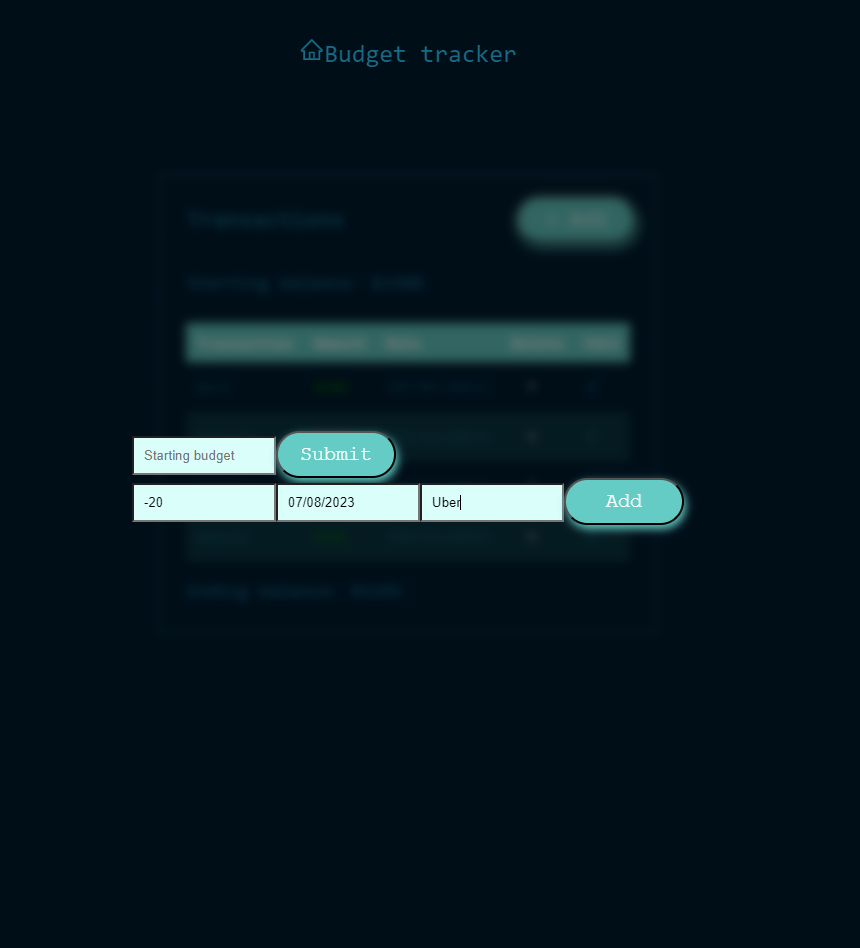
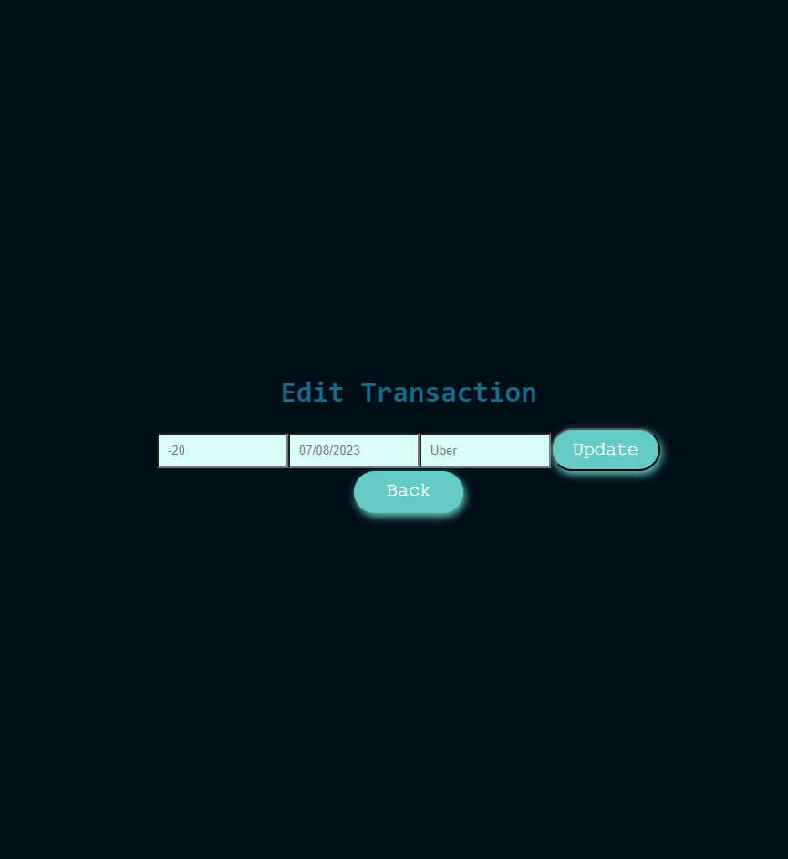

# Budget Tracker

A web application to track your budget and expenses.

## Table of Contents
- [Description](#description)
- [Installation](#installation)
- [Usage](#usage)
- [Contributing](#contributing)
- [License](#license)
- [Credits](#credits)

## Description
Budget Tracker is a web application that allows you to track your budget and expenses. It provides a user-friendly interface to manage and monitor your financial transactions.

## Installation
To install Budget Tracker locally, follow these steps:

1. Clone the repository:
   ```
   git clone https://github.com/AhmedHamza667/budget-tracker.git
   ```
2. Navigate to the project directory:
   ```
   cd budget-tracker
   ```
3. Install the dependencies:
   ```
   npm install
   ```
4. Start the JSON server for data management:
   ```
   json-server --watch db.json
   ```
5. Run the application:
   ```
   npm run dev
   ```

## Usage
After installing and running the application, you can access it through your web browser. Budget Tracker allows you to add income and expenses, categorize transactions, and view your financial overview with helpful charts and insights.

## Contributing
We welcome contributions to Budget Tracker. To contribute, please follow these steps:

1. Fork the repository on GitHub.
2. Create a new branch for your feature or bug fix.
3. Make your changes and ensure that the tests pass.
4. Commit your changes and push them to your fork.
5. Submit a pull request describing your changes and why they should be merged.

## Contributors
- Ahmed Hamza

## License
This project is licensed under the [MIT License](LICENSE).

## Credits
We would like to acknowledge the following technologies used in building Budget Tracker:
- React
- JavaScript
- CSS

Feel free to customize this template based on your specific requirements and preferences.




